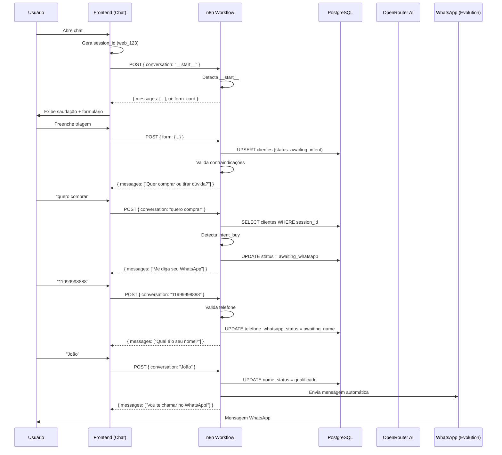

# Integração Landing Page ↔ n8n - TirzepaLife

**Documentação técnica completa sobre a comunicação bidirecional entre a landing page Next.js e os workflows n8n**

---

## 📋 Sumário

1. [Visão Geral](#visão-geral)
2. [Arquitetura](#arquitetura)
3. [Fluxo do Chat (AIChatButton)](#fluxo-do-chat-aichatbutton)
4. [Fluxo do Formulário (ContactSection)](#fluxo-do-formulário-contactsection)
5. [Estrutura dos Payloads](#estrutura-dos-payloads)
6. [Respostas do n8n](#respostas-do-n8n)
7. [Workflow n8n Detalhado](#workflow-n8n-detalhado)
8. [Gerenciamento de Sessão](#gerenciamento-de-sessão)
9. [Banco de Dados](#banco-de-dados)
10. [Casos de Uso Completos](#casos-de-uso-completos)

---

## Visão Geral

O sistema TirzepaLife possui **duas formas de captura de leads**:

### 1. **Chat AI (Principal)** 
- Componente: `AIChatButton.tsx`
- Webhook: `https://webh.procexai.tech/webhook/TizerpaLife`
- Fluxo: Conversa → Triagem → Coleta WhatsApp → Coleta Nome → Handoff

### 2. **Formulário Tradicional**
- Componente: `ContactSection.tsx`
- Rota API: `/api/leads`
- Webhook: `https://webh.procexai.tech/webhook/TizerpaLife-Formulario`
- Fluxo: Preenchimento → Validação → Envio direto

**Ambos os fluxos convergem para o banco de dados PostgreSQL e disparam automação WhatsApp via n8n.**

---

## Arquitetura

```
┌─────────────────────────────────────────────────────────────┐
│                    LANDING PAGE (Next.js)                    │
├─────────────────────────────────────────────────────────────┤
│                                                               │
│  ┌──────────────────┐              ┌────────────────────┐   │
│  │  AIChatButton    │              │  ContactSection    │   │
│  │  (Chat IA)       │              │  (Formulário)      │   │
│  └────────┬─────────┘              └─────────┬──────────┘   │
│           │                                   │              │
│           │ POST (payload complexo)           │ POST (form)  │
│           ▼                                   ▼              │
│  webhook/TizerpaLife                   /api/leads           │
│           │                                   │              │
└───────────┼───────────────────────────────────┼──────────────┘
            │                                   │
            │                                   │ relay to n8n
            │                                   ▼
            │                    webhook/TizerpaLife-Formulario
            │                                   │
            ▼                                   │
    ┌───────────────────────────────────────────▼────────┐
    │              n8n WORKFLOW (site.json)              │
    ├────────────────────────────────────────────────────┤
    │  • Recebe webhook                                  │
    │  • Identifica tipo de mensagem                     │
    │  • Processa áudio/imagem/texto                     │
    │  • Consulta/atualiza banco PostgreSQL              │
    │  • Gerencia estado da conversa (stages)            │
    │  • Chama AI Agent (OpenRouter + DeepSeek)          │
    │  • Retorna resposta estruturada                    │
    └────────────────┬───────────────────────────────────┘
                     │
                     ├─► PostgreSQL (clientes table)
                     ├─► Redis (cache de mensagens)
                     └─► WhatsApp (Evolution API)
```

---

## Fluxo do Chat (AIChatButton)

### 1. **Inicialização da Sessão**

**Quando o chat abre pela primeira vez:**

```typescript
// AIChatButton.tsx:83-92
const [sessionId] = useState(() => {
  const stored = localStorage.getItem('chat_session_id');
  if (stored) return stored;
  const newId = `web_${Math.floor(Math.random() * 1000000000)}`;
  localStorage.setItem('chat_session_id', newId);
  return newId;
});
```

**Formato da sessão:** `web_123456789@s.whatsapp.net`

### 2. **Mensagem Inicial (__start__)**

Assim que o chat abre, envia automaticamente:

```typescript
// AIChatButton.tsx:279-305
const bootstrap = (isTriageCompleted() && getStoredTriage()) 
  ? "__resume__" 
  : "__start__";

const payload = {
  data: {
    key: {
      remoteJid: "web_123456789@s.whatsapp.net",
      fromMe: false,
      id: "start_1765905568458"
    },
    pushName: "Visitante Web",
    message: {
      conversation: "__start__"
    },
    messageType: "conversation",
    messageTimestamp: 1765905568,
    instanceId: "web-client-integration",
    source: "web",
    client_context: {
      session_id: "web_123456789",
      triage_completed: false,
      triage: null,
      last_messages: [],
      page: { path: "/", url: "https://..." },
      timestamp_ms: 1765905568458
    }
  },
  sender: "web_123456789@s.whatsapp.net"
};
```

**O n8n detecta `__start__` e retorna:**

```json
{
  "messages": [
    { "text": "Olá! Eu sou a Dra. Ana, consultora de saúde da TirzepaLife.", "delay": 800 },
    { "text": "Pra te orientar com segurança, responde essa triagem rapidinha:", "delay": 1200 }
  ],
  "ui": {
    "type": "form_card",
    "id": "triage_v1",
    "title": "Triagem rápida (1 minuto)",
    "description": "É só pra eu te direcionar com mais segurança.",
    "submitLabel": "Continuar",
    "fields": [
      {
        "name": "goal",
        "label": "Seu foco é mais…",
        "type": "single_select",
        "required": true,
        "options": [
          { "value": "emagrecimento", "label": "Emagrecimento" },
          { "value": "apetite", "label": "Controle de apetite" },
          { "value": "metabolico", "label": "Controle metabólico" }
        ]
      },
      {
        "name": "used_glp1",
        "label": "Você já usou algum medicamento similar?",
        "type": "single_select",
        "required": true,
        "options": [
          { "value": "sim", "label": "Sim" },
          { "value": "nao", "label": "Não" }
        ]
      },
      {
        "name": "pregnant_lactating",
        "label": "Por segurança: você está grávida ou amamentando?",
        "type": "single_select",
        "required": true,
        "options": [
          { "value": "sim", "label": "Sim" },
          { "value": "nao", "label": "Não" }
        ]
      },
      {
        "name": "thyroid_history",
        "label": "Você tem histórico de câncer medular de tireoide ou NEM2?",
        "type": "single_select",
        "required": true,
        "options": [
          { "value": "sim", "label": "Sim" },
          { "value": "nao", "label": "Não" },
          { "value": "nao_sei", "label": "Não sei" }
        ]
      }
    ]
  }
}
```

### 3. **Envio da Triagem**

Quando o usuário preenche e submete o formulário:

```typescript
// AIChatButton.tsx:349-392
const handleSubmitTriage = async (schema, values) => {
  // values = { goal: "emagrecimento", used_glp1: "nao", ... }
  
  const resumo = "Triagem preenchida: Objetivo=Emagrecimento; Já usou GLP-1=Não; ...";
  
  const payload = {
    data: {
      key: { remoteJid: "web_123456789@s.whatsapp.net", ... },
      message: { conversation: resumo },
      messageType: "conversation",
      source: "web",
      form: values,  // ← Dados estruturados
      form_id: "triage_v1",
      client_context: { ... }
    },
    sender: "web_123456789@s.whatsapp.net"
  };
  
  // Salva localmente para permitir retomada
  storeTriage(values);
  localStorage.setItem(triageCompletedKey, "1");
};
```

**O n8n:**
1. Detecta `data.form` preenchido
2. Valida contraindicações (`pregnant_lactating === 'sim'` OU `thyroid_history === 'sim'`)
3. Faz `UPSERT` no banco:

```sql
INSERT INTO public.clientes (
  session_id, status_qualificacao, origem, gestante_lactante, 
  historico_tireoide, uso_anterior_glp1, observacoes
) VALUES (
  'web_123456789@s.whatsapp.net',
  CASE WHEN contraindicacao THEN 'disqualified' ELSE 'awaiting_intent' END,
  'site_chat',
  false,
  false,
  false,
  'goal=emagrecimento; thyroid_history=nao'
)
ON CONFLICT (session_id) DO UPDATE SET ...
```

**Se DESQUALIFICADO (contraindicação):**

```json
{
  "messages": [
    { "text": "Obrigada por me contar — por segurança eu não consigo seguir com orientações.", "delay": 800 },
    { "text": "O ideal é conversar com seu médico/endócrino para uma avaliação personalizada.", "delay": 1200 }
  ]
}
```

**Se QUALIFICADO:**

```json
{
  "messages": [
    { "text": "Perfeito, obrigada! 🙏", "delay": 700 },
    { "text": "Você quer comprar agora ou prefere tirar uma dúvida antes?", "delay": 1100 }
  ]
}
```

### 4. **Detecção de Intenção de Compra**

O usuário responde "quero comprar":

```typescript
// Payload normal de mensagem
{
  data: {
    message: { conversation: "quero comprar" },
    client_context: {
      session_id: "web_123456789",
      triage_completed: true,
      triage: { goal: "emagrecimento", ... }
    }
  }
}
```

**O n8n:**
1. Carrega registro do banco (status = `awaiting_intent`)
2. Detecta palavras-chave: `/compr|comprar|preço|pix|finalizar|quero/i`
3. Atualiza status para `awaiting_whatsapp`
4. Responde:

```json
{
  "messages": [
    { "text": "Perfeito.", "delay": 700 },
    { "text": "Me diga seu WhatsApp com DDD (somente números), por favor.", "delay": 1100 }
  ]
}
```

### 5. **Coleta de WhatsApp**

Usuário envia: "11999998888"

**O n8n:**
1. Normaliza telefone (remove caracteres, valida DDD)
2. Atualiza banco:

```sql
UPDATE public.clientes 
SET telefone_whatsapp = '5511999998888', 
    status_qualificacao = 'awaiting_name' 
WHERE session_id = 'web_123456789@s.whatsapp.net';
```

3. Responde:

```json
{
  "messages": [
    { "text": "Perfeito — obrigada!", "delay": 700 },
    { "text": "Qual é o seu nome? (só o primeiro nome já ajuda)", "delay": 1100 }
  ]
}
```

**Se telefone inválido:**

```json
{
  "messages": [
    { "text": "Acho que faltou o DDD. Pode me mandar assim: 11999998888?", "delay": 900 }
  ]
}
```

### 6. **Coleta de Nome e Handoff**

Usuário envia: "João"

**O n8n:**
1. Atualiza banco:

```sql
UPDATE public.clientes 
SET nome = 'João', 
    status_qualificacao = 'qualificado' 
WHERE session_id = 'web_123456789@s.whatsapp.net';
```

2. Responde:

```json
{
  "messages": [
    { "text": "Perfeito, obrigado! Vou te chamar no WhatsApp agora pra seguir com os próximos passos.", "delay": 900 }
  ]
}
```

3. **Dispara automação WhatsApp** (outro workflow envia mensagem para o número coletado)

### 7. **Retomada de Sessão (__resume__)**

Se o usuário fecha e reabre o chat:

```typescript
// AIChatButton.tsx:289
const bootstrap = (isTriageCompleted() && getStoredTriage()) 
  ? "__resume__" 
  : "__start__";
```

**O n8n:**
1. Detecta `__resume__`
2. Consulta banco pelo `session_id`
3. Retoma do estágio atual (ex: `awaiting_whatsapp`)
4. Responde com a próxima pergunta apropriada

---

## Fluxo do Formulário (ContactSection)

### 1. **Preenchimento**

```typescript
// ContactSection.tsx:14-26
const formData = {
  name: "Maria Silva",
  phone: "(11) 99999-8888",  // Máscara visual
  weight: "75",
  height: "165",
  goal: ""
};

const exclusions = {
  pregnant: false,
  cancerHistory: false,
  pancreatitis: false
};
```

### 2. **Validação e Normalização**

```typescript
// ContactSection.tsx:50-60
const normalizeWhatsappBr = (phone: string): string => {
  const digits = phone.replace(/\D/g, '');
  // Remove código do país se vier
  if (digits.startsWith('55') && (digits.length === 12 || digits.length === 13)) {
    return digits.slice(2);
  }
  // DDD + número (10 ou 11 dígitos)
  if (digits.length === 10 || digits.length === 11) return digits;
  return '';
};
```

**CRÍTICO:** Telefone é armazenado SEM o prefixo `55` no banco!

### 3. **Submissão**

```typescript
// ContactSection.tsx:77-129
const handleSubmit = async (e) => {
  // Valida contraindicações
  if (exclusions.pregnant || exclusions.cancerHistory || exclusions.pancreatitis) {
    setStatus('disqualified');
    return;
  }
  
  const payload = {
    nome: "Maria Silva",
    telefone_whatsapp: "11999998888",  // SEM 55
    condicao_medica: "Avaliação Peso/Altura",
    gestante_lactante: false,
    historico_tireoide: false,
    uso_anterior_glp1: false,
    dosagem_interesse: null,
    origem: "formulario_site",
    observacoes: "Peso: 75kg, Altura: 165cm, Histórico Pancreatite: Não"
  };
  
  const res = await fetch("/api/leads", {
    method: "POST",
    headers: { "Content-Type": "application/json" },
    body: JSON.stringify(payload),
    signal: controller.signal,  // timeout 10s
  });
};
```

### 4. **Rota API (/api/leads)**

```typescript
// src/app/api/leads/route.ts:17-65
export async function POST(req: Request) {
  const body = await req.json();
  
  // Valida campos obrigatórios
  const nome = body.nome.trim();
  const telefone = body.telefone_whatsapp.replace(/\D/g, "");
  
  if (!nome) return NextResponse.json({ error: "Campo 'nome' é obrigatório" }, { status: 400 });
  if (!(telefone.length === 10 || telefone.length === 11)) {
    return NextResponse.json({ error: "Telefone inválido" }, { status: 400 });
  }
  
  // Encaminha para n8n
  const upstream = await fetch(
    "https://webh.procexai.tech/webhook/TizerpaLife-Formulario",
    {
      method: "POST",
      headers: { "Content-Type": "application/json" },
      body: JSON.stringify({ ...body, nome, telefone_whatsapp: telefone }),
    }
  );
  
  return new NextResponse(await upstream.text(), { status: 200 });
}
```

### 5. **Processamento n8n (Formulário)**

**Workflow separado:** `TizerpaLife-Formulario`

1. Recebe payload do formulário
2. Faz `INSERT` no banco:

```sql
INSERT INTO public.clientes (
  nome, telefone_whatsapp, condicao_medica, 
  gestante_lactante, historico_tireoide, 
  origem, status_qualificacao, atendido
) VALUES (
  'Maria Silva', '11999998888', 'Avaliação Peso/Altura',
  false, false, 'formulario_site', 'qualificado', false
)
ON CONFLICT (telefone_whatsapp) DO UPDATE SET updated_at = NOW();
```

3. Dispara mensagem WhatsApp automática para o número fornecido
4. Retorna `200 OK`

---

## Estrutura dos Payloads

### Payload Padrão (Chat)

```json
{
  "data": {
    "key": {
      "remoteJid": "web_123456789@s.whatsapp.net",
      "fromMe": false,
      "id": "1765905568458"
    },
    "pushName": "Visitante Web",
    "message": {
      "conversation": "Texto da mensagem do usuário"
    },
    "messageType": "conversation",
    "messageTimestamp": 1765905568,
    "instanceId": "web-client-integration",
    "source": "web",
    "client_context": {
      "session_id": "web_123456789",
      "triage_completed": false,
      "triage": null,
      "last_messages": [
        { "sender": "user", "content": "olá", "timestamp": 1765905500000 },
        { "sender": "ai", "content": "Olá!", "timestamp": 1765905501000 }
      ],
      "page": {
        "path": "/",
        "url": "https://tirzepalife-lp-v2.vercel.app/"
      },
      "timestamp_ms": 1765905568458
    }
  },
  "sender": "web_123456789@s.whatsapp.net"
}
```

### Payload com Formulário de Triagem

```json
{
  "data": {
    "key": { ... },
    "message": {
      "conversation": "Triagem preenchida: Objetivo=Emagrecimento; Já usou GLP-1=Não; Grávida/amamentando=Não; Histórico câncer medular/NEM2=Não."
    },
    "messageType": "conversation",
    "source": "web",
    "form": {
      "goal": "emagrecimento",
      "used_glp1": "nao",
      "pregnant_lactating": "nao",
      "thyroid_history": "nao"
    },
    "form_id": "triage_v1",
    "client_context": { ... }
  },
  "sender": "web_123456789@s.whatsapp.net"
}
```

### Payload com Áudio

```json
{
  "data": {
    "key": { ... },
    "message": {
      "audioMessage": {
        "url": "https://...",
        "mimetype": "audio/ogg; codecs=opus",
        "seconds": 5
      }
    },
    "messageType": "audioMessage",
    "source": "web"
  }
}
```

**O n8n:**
1. Baixa áudio da URL via Evolution API
2. Transcreve com Whisper (Groq)
3. Limpa transcrição com OpenAI GPT-4.1-mini
4. Processa texto resultante

### Payload com Imagem

```json
{
  "data": {
    "key": { ... },
    "message": {
      "imageMessage": {
        "caption": "o que diz nessa receita?",
        "url": "https://...",
        "base64": "iVBORw0KGgoAAAANS..."
      }
    },
    "messageType": "imageMessage",
    "source": "web"
  }
}
```

**O n8n:**
1. Extrai base64
2. Analisa com OpenAI GPT-4o-mini (visão)
3. Retorna texto descritivo
4. Processa texto

---

## Respostas do n8n

### Resposta Simples (Texto)

```json
{
  "messages": [
    { "text": "Olá! Como posso ajudar?", "delay": 800 }
  ]
}
```

### Resposta Múltipla (Formato M3M)

```json
{
  "messages": [
    { "text": "Primeiro bloco de mensagem.", "delay": 800 },
    { "text": "Segundo bloco de mensagem.", "delay": 1200 },
    { "text": "Terceiro bloco de mensagem.", "delay": 1500 }
  ]
}
```

**Delays calculados dinamicamente:**

```javascript
// n8n: Tempo Digitacao 3 node
delay = Math.min(
  Math.max((text.replace(/\s+/g, '').length) * 50, 1500),
  6000
) + (itemIndex * 2000);
```

- Mínimo: 1500ms
- Máximo: 6000ms
- Base: 50ms por caractere
- Incremento: +2000ms por mensagem

### Resposta com UI (Form Card)

```json
{
  "messages": [
    { "text": "Vou precisar de algumas informações:", "delay": 800 }
  ],
  "ui": {
    "type": "form_card",
    "id": "triage_v1",
    "title": "Triagem rápida",
    "description": "Leva apenas 1 minuto",
    "submitLabel": "Continuar",
    "fields": [
      {
        "name": "goal",
        "label": "Qual é o seu objetivo?",
        "type": "single_select",
        "required": true,
        "options": [
          { "value": "emagrecimento", "label": "Emagrecimento" },
          { "value": "controle", "label": "Controle" }
        ],
        "helperText": "Escolha a opção que melhor descreve"
      }
    ]
  }
}
```

### Resposta de Erro (Fallback)

Se o n8n falhar ou não responder em 2 minutos:

```typescript
// AIChatButton.tsx:294-302
catch (error) {
  const errorMsg = {
    content: "Estou com dificuldades de conexão. Tente novamente em instantes.",
    sender: 'ai',
    timestamp: Date.now()
  };
  setMessages(prev => [...prev, errorMsg]);
}
```

---

## Workflow n8n Detalhado

### Estrutura Geral

```
Webhook → config → mensagem_tipo (Switch) → [processamento] → AI Agent → Respond
```

### Nós Principais

#### 1. **Webhook** (Recepção)
- Endpoint: `/webhook/TizerpaLife`
- Método: POST
- Modo: `responseNode` (aguarda processamento completo)

#### 2. **config** (Extração)
```javascript
{
  remoteJid: "web_123456789@s.whatsapp.net",
  id: "1765905568458",
  mensagem: "texto da conversa",
  messageType: "conversation"
}
```

#### 3. **mensagem_tipo** (Switch)
Roteia por tipo:
- `audioMessage` → Baixar Áudio → Whisper → Limpar
- `imageMessage` → Extrair base64 → OpenAI Vision → Texto
- `conversation` → edit2 (extração direta)
- `extendedTextMessage` → edit2

#### 4. **edit2** (Normalização)
```javascript
{
  texto: data.form 
    ? `Triagem (form_card): goal=${form.goal}; ...`
    : data.message.conversation,
  is_resume: data.message.conversation === '__resume__' ? 'sim' : 'nao'
}
```

#### 5. **If Start**
Se `texto === "__start__"`:
- **SIM** → Resposta Start (com form_card)
- **NÃO** → If Form Submission

#### 6. **If Form Submission**
Se `data.form` existe:
- **SIM** → Set Form Vars → Upsert PreLead (Triage) → If Disqualified
- **NÃO** → Load PreLead Session

#### 7. **Upsert PreLead (Triage)**
```sql
INSERT INTO public.clientes (
  session_id, status_qualificacao, origem, 
  gestante_lactante, historico_tireoide, uso_anterior_glp1, observacoes
) VALUES ($1, $2, 'site_chat', $3, $4, $5, $6)
ON CONFLICT (session_id) DO UPDATE SET ...
```

#### 8. **If Disqualified**
Se `pregnant_lactating === 'sim'` OU `thyroid_history === 'sim'`:
- **SIM** → Resposta Disqualified (encerra conversa)
- **NÃO** → Resposta Pós-Triagem (pergunta intenção)

#### 9. **Load PreLead Session**
```sql
SELECT session_id, texto, is_resume, 
       status_qualificacao, telefone_whatsapp, nome
FROM clientes
WHERE session_id = $1
ORDER BY updated_at DESC
LIMIT 1;
```

#### 10. **Máquina de Estados**

**Estados possíveis:**
- `awaiting_intent` → Aguardando decisão de compra
- `awaiting_whatsapp` → Aguardando número WhatsApp
- `awaiting_name` → Aguardando nome
- `qualificado` → Lead completo (handoff)
- `disqualified` → Desqualificado

**Transições:**

```
┌─────────────────┐
│ awaiting_intent │
└────────┬────────┘
         │ detecta "quero comprar"
         ▼
┌──────────────────┐
│awaiting_whatsapp │
└────────┬─────────┘
         │ valida telefone
         ▼
┌─────────────────┐
│ awaiting_name   │
└────────┬────────┘
         │ salva nome
         ▼
┌─────────────────┐
│   qualificado   │ → Dispara WhatsApp
└─────────────────┘
```

#### 11. **mensagem_cliente** (Contexto para AI)
```javascript
{
  texto: `CONTEXTO_INTERNO (não expor): 
    lead=${JSON.stringify(lead)} | 
    client_context=${JSON.stringify(ctx)}
    
    ${mensagemUsuario}`,
  id: "1765905568458",
  numeroCliente: "web_123456789@s.whatsapp.net"
}
```

#### 12. **AI Agent** (OpenRouter DeepSeek v3.2)
- **System Message:**
  ```
  Você é a Dra. Ana (TirzepaLife), primeira linha de atendimento no site.
  Objetivo: acolher, esclarecer dúvidas gerais (sem diagnóstico/sem promessas) 
  e conduzir para o próximo passo no WhatsApp.
  
  Regras:
  - Sempre em pt-BR
  - Nunca informe preço ou dose
  - 1 CTA/pergunta por vez
  - Se houver CONTEXTO_INTERNO, NÃO exponha, use apenas para decidir
  - Se mensagem for "__resume__", continue do ponto que parou
  ```

- **Memória:** Postgres Chat Memory (histórico de conversas por `numeroCliente`)
- **Tools:** `toolAtualizarDadosCliente` (permite AI fazer INSERT/UPDATE no banco)

#### 13. **Quebra da Resposta** (M3M)
```javascript
{
  text: $json.output.split('\n\n')  // ["bloco 1", "bloco 2", "bloco 3"]
}
```

#### 14. **Tempo Digitacao** (Cálculo de delays)
```javascript
delay = Math.min(
  Math.max((text.replace(/\s+/g, '').length) * 50, 1500),
  6000
) + (itemIndex * 2000);
```

#### 15. **Aggregate Messages**
```javascript
{
  messages: [
    { text: "bloco 1", delay: 1500 },
    { text: "bloco 2", delay: 3200 },
    { text: "bloco 3", delay: 4800 }
  ]
}
```

#### 16. **Respond to Webhook**
Retorna JSON para o frontend

---

## Gerenciamento de Sessão

### Frontend (localStorage)

```typescript
// Chaves utilizadas:
chat_session_id              // "web_123456789"
triage_completed_web_123456789   // "1" ou null
triage_values_web_123456789      // JSON: { goal: "...", ... }
```

### Backend (Redis - Cache temporário)

```
Chave: "web_123456789@s.whatsapp.net"
Valor: ["mensagem1", "mensagem2", ...]
TTL: 60 segundos
```

**Função:** Evitar reprocessamento de mensagens duplicadas (debouncing)

### Banco de Dados (PostgreSQL)

```sql
-- Registro persistente
SELECT * FROM clientes WHERE session_id = 'web_123456789@s.whatsapp.net';
```

---

## Banco de Dados

### Tabela `clientes`

```sql
CREATE TABLE public.clientes (
  id SERIAL PRIMARY KEY,
  nome VARCHAR(255),
  telefone_whatsapp VARCHAR(20) UNIQUE,  -- 10-11 dígitos SEM 55
  session_id VARCHAR(255) UNIQUE,        -- web_XXX@s.whatsapp.net
  status_qualificacao VARCHAR(50),       -- awaiting_intent, awaiting_whatsapp, awaiting_name, qualificado, disqualified
  origem VARCHAR(50),                    -- formulario_site, site_chat, whatsapp
  gestante_lactante BOOLEAN,
  historico_tireoide BOOLEAN,
  uso_anterior_glp1 BOOLEAN,
  dosagem_interesse VARCHAR(50),
  condicao_medica TEXT,
  observacoes TEXT,
  atendido BOOLEAN DEFAULT false,
  cpf VARCHAR(14),
  asaas_payment_id VARCHAR(100),
  asaas_status VARCHAR(50),
  created_at TIMESTAMP DEFAULT NOW(),
  updated_at TIMESTAMP DEFAULT NOW()
);

-- Índices
CREATE INDEX idx_telefone ON clientes(telefone_whatsapp);
CREATE INDEX idx_session ON clientes(session_id);
CREATE INDEX idx_status ON clientes(status_qualificacao);
```

### Tabela `langchain_chat_histories`

```sql
-- Histórico de mensagens da AI (usado pelo Postgres Chat Memory)
CREATE TABLE langchain_chat_histories (
  id SERIAL PRIMARY KEY,
  session_id VARCHAR(255) NOT NULL,     -- web_123456789@s.whatsapp.net
  message JSONB NOT NULL,
  created_at TIMESTAMP DEFAULT NOW()
);
```

**Formato de `message`:**
```json
{
  "type": "human",  // ou "ai"
  "content": "texto da mensagem"
}
```

---

## Casos de Uso Completos

### Caso 1: Usuário Qualificado (Chat Completo)

**1. Usuário abre chat**
```
→ POST webhook/TizerpaLife { conversation: "__start__" }
← { messages: [...], ui: { form_card } }
```

**2. Preenche triagem (qualificado)**
```
→ POST webhook/TizerpaLife { 
    conversation: "Triagem preenchida...",
    form: { goal: "emagrecimento", pregnant_lactating: "nao", ... }
  }
← { messages: ["Perfeito! Você quer comprar ou tirar dúvida?"] }
```

**3. Manifesta intenção de compra**
```
→ POST webhook/TizerpaLife { conversation: "quero comprar" }
← { messages: ["Me diga seu WhatsApp com DDD"] }
```

**4. Envia WhatsApp**
```
→ POST webhook/TizerpaLife { conversation: "11999998888" }
← { messages: ["Perfeito! Qual é o seu nome?"] }
```

**5. Envia nome**
```
→ POST webhook/TizerpaLife { conversation: "João" }
← { messages: ["Vou te chamar no WhatsApp agora!"] }
```

**6. WhatsApp automatizado**
- n8n dispara mensagem no Evolution API
- Outro workflow (vendas WhatsApp) assume o atendimento

### Caso 2: Usuário Desqualificado (Contraindicação)

**1-2. Abre chat e preenche triagem**
```
→ form: { pregnant_lactating: "sim" }
← { messages: [
    "Obrigada por me contar — por segurança eu não consigo seguir.",
    "O ideal é conversar com seu médico."
  ]}
```

**Status no banco:** `disqualified`  
**Conversa:** Encerrada

### Caso 3: Formulário Tradicional

**1. Preenche formulário**
```html
Nome: Maria Silva
WhatsApp: (11) 99999-8888
Peso: 75kg
Altura: 165cm
☐ Grávida/Amamentando
☐ Histórico Câncer Tireoide
☐ Histórico Pancreatite
```

**2. Submissão**
```
→ POST /api/leads {
    nome: "Maria Silva",
    telefone_whatsapp: "11999998888",
    gestante_lactante: false,
    historico_tireoide: false,
    origem: "formulario_site"
  }
  
→ (relay) POST webhook/TizerpaLife-Formulario
← 200 OK
```

**3. Banco**
```sql
INSERT INTO clientes (
  nome, telefone_whatsapp, origem, status_qualificacao
) VALUES (
  'Maria Silva', '11999998888', 'formulario_site', 'qualificado'
);
```

**4. WhatsApp automático enviado**

### Caso 4: Retomada de Sessão

**Contexto:** Usuário completou triagem mas fechou o chat

**1. Reabre chat (mesmo navegador)**
```
→ POST webhook/TizerpaLife { 
    conversation: "__resume__",
    client_context: {
      session_id: "web_123456789",
      triage_completed: true,
      triage: { goal: "emagrecimento", ... }
    }
  }
```

**2. n8n consulta banco**
```sql
SELECT status_qualificacao FROM clientes 
WHERE session_id = 'web_123456789@s.whatsapp.net';
-- Retorna: "awaiting_intent"
```

**3. Resposta**
```
← { messages: ["Você quer comprar agora ou tirar uma dúvida?"] }
```

**Fluxo continua do ponto que parou!**

### Caso 5: Processamento de Áudio

**1. Usuário envia áudio**
```
→ POST webhook/TizerpaLife {
    messageType: "audioMessage",
    message: {
      audioMessage: { url: "https://...", seconds: 5 }
    }
  }
```

**2. n8n:**
- Baixa áudio da URL (Evolution API)
- Transcreve com Whisper (Groq)
- Limpa transcrição com GPT-4.1-mini
- Resultado: "quero saber sobre o tratamento"

**3. Processa como texto normal**
```
← { messages: ["O Mounjaro é indicado para..."] }
```

---

## Pontos Críticos de Atenção

### 🔴 Formato de Telefone

**NUNCA mude sem verificar:**

```typescript
// ✅ CORRETO no banco
telefone_whatsapp: "11999998888"  // 10-11 dígitos

// ❌ ERRADO no banco
telefone_whatsapp: "5511999998888"

// ✅ CORRETO ao enviar WhatsApp (n8n adiciona 55)
Evolution API: "5511999998888"
```

### 🟡 Timeouts

- **Chat:** 2 minutos (120s)
- **Formulário:** 10 segundos
- **n8n Wait node:** 1 segundo (debounce)

### 🟢 Mensagens Especiais

- `__start__` → Inicia conversa
- `__resume__` → Retoma conversa
- `CONTEXTO_INTERNO (não expor)` → AI não deve mencionar

### 🔵 Delays de Mensagens

Fórmula: `min(max(length * 50, 1500), 6000) + index * 2000`

- 1ª msg curta: 1500ms
- 2ª msg média: 3200ms
- 3ª msg longa: 5800ms

### 🟣 Contraindicações Absolutas

- `pregnant_lactating === "sim"` → DISQUALIFIED
- `thyroid_history === "sim"` → DISQUALIFIED
- `goal !== "emagrecimento"` → DISQUALIFIED (pode variar)

---

## Diagrama de Sequência Completo



---

## Conclusão

Este sistema implementa um **funil de qualificação inteligente e progressivo**:

1. **Captura** via chat IA ou formulário
2. **Triagem** automática com validação de contraindicações
3. **Qualificação** progressiva (intenção → WhatsApp → nome)
4. **Persistência** em banco com estados claros
5. **Handoff** automatizado para WhatsApp
6. **Retomada** de sessão sem perda de contexto

**Vantagens:**
- ✅ Experiência conversacional natural
- ✅ Validação médica automática (segurança)
- ✅ Múltiplos formatos de entrada (texto/áudio/imagem)
- ✅ Dados estruturados no banco
- ✅ Integração completa com WhatsApp
- ✅ Rastreamento de origem (chat vs formulário)
- ✅ Histórico persistente de conversas

**Pontos de melhoria:**
- Adicionar analytics de abandono por etapa
- Implementar webhooks de callback (notificar frontend quando WhatsApp é enviado)
- Cache de respostas frequentes (FAQ)
- Testes A/B de mensagens

---

**Última atualização:** 16/12/2025  
**Versão do workflow:** site.json (2489 linhas)  
**Versão do chat:** AIChatButton.tsx (647 linhas)

