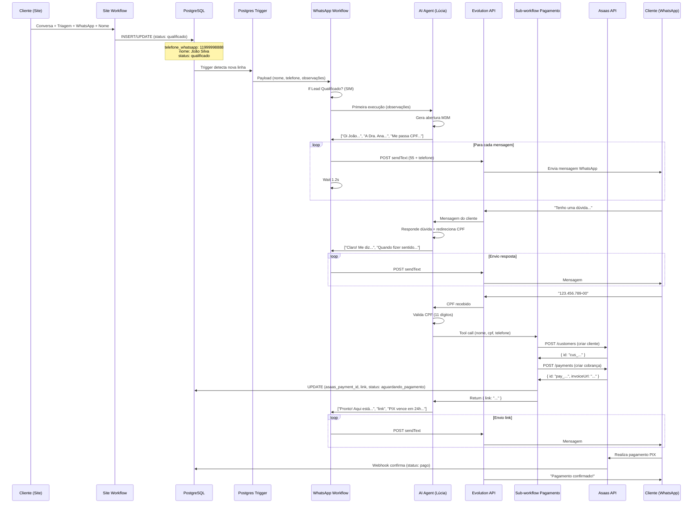

# Jornada de Vendas WhatsApp (n8n) - TirzepaLife

**Documentação completa do fluxo automatizado de vendas: da qualificação no site ao pagamento confirmado**

---

## 📋 Sumário

1. [Visão Geral](#visão-geral)
2. [Arquitetura de Workflows](#arquitetura-de-workflows)
3. [Etapa 1: Qualificação no Site](#etapa-1-qualificação-no-site)
4. [Etapa 2: Trigger PostgreSQL](#etapa-2-trigger-postgresql)
5. [Etapa 3: Primeira Mensagem WhatsApp](#etapa-3-primeira-mensagem-whatsapp)
6. [Etapa 4: Conversação de Vendas (AI Agent Lúcia)](#etapa-4-conversação-de-vendas-ai-agent-lúcia)
7. [Etapa 5: Coleta de CPF](#etapa-5-coleta-de-cpf)
8. [Etapa 6: Geração de Pagamento](#etapa-6-geração-de-pagamento)
9. [Etapa 7: Acompanhamento e Confirmação](#etapa-7-acompanhamento-e-confirmação)
10. [Fluxo Completo Detalhado](#fluxo-completo-detalhado)
11. [Máquina de Estados](#máquina-de-estados)
12. [Casos de Uso](#casos-de-uso)

---

## Visão Geral

O sistema automatizado de vendas funciona em **3 workflows integrados**:

### Workflow 1: Site (TizerpaLife)
- **Função:** Qualificação de leads via chat no site
- **Saída:** Lead qualificado salvo no PostgreSQL
- **Status final:** `qualificado`

### Workflow 2: WhatsApp Vendas (whatsapp.json)
- **Função:** Automação de vendas via WhatsApp
- **Trigger:** Nova linha no PostgreSQL com status `qualificado`
- **Agente:** Lúcia (consultora de vendas)
- **Objetivo:** Coletar CPF e gerar pagamento PIX

### Workflow 3: Sub-workflow Pagamento (criar-cliente.json)
- **Função:** Integração com Asaas (gateway de pagamento)
- **Ações:** Criar cliente → Gerar cobrança → Salvar no banco
- **Status final:** `aguardando_pagamento`

---

## Arquitetura de Workflows

```
┌─────────────────────────────────────────────────────────────┐
│                    SITE WORKFLOW                             │
│  Cliente conversa → Triagem → Coleta WhatsApp + Nome        │
│  ↓ INSERT INTO clientes (status: qualificado)               │
└──────────────────────────┬──────────────────────────────────┘
                           │
                           │ PostgreSQL Trigger
                           ▼
┌─────────────────────────────────────────────────────────────┐
│               WHATSAPP VENDAS WORKFLOW                       │
├─────────────────────────────────────────────────────────────┤
│  Postgres Trigger (detecta nova linha)                      │
│         ↓                                                    │
│  If Lead Qualificado? (status = qualificado + tem telefone) │
│         ↓ SIM                                                │
│  config (extrai: nome, telefone, observações)               │
│         ↓                                                    │
│  AI Agent (Lúcia - vendas)                                   │
│    • Memória: Postgres Chat Memory                          │
│    • LLM: DeepSeek v3.2 (OpenRouter)                        │
│    • Tools: [sub-workflow-TirzepaLife, Pós-Venda]          │
│         ↓                                                    │
│  Quebra da Resposta (split por \n)                          │
│         ↓                                                    │
│  Loop Over Items (cada mensagem)                            │
│         ↓                                                    │
│  sendText (Evolution API)                                   │
│    POST https://evolution3.procexai.tech/message/sendText   │
│    Body: { number: "5511999998888", text: "...", delay: 1200 } │
│         ↓                                                    │
│  Wait (1.2s entre mensagens)                                │
│         ↓ (loop até acabar mensagens)                        │
│  Cliente responde...                                         │
│         ↓                                                    │
│  [Cliente fornece CPF]                                       │
│         ↓                                                    │
│  AI Agent usa tool: sub-workflow-TirzepaLife                │
└──────────────────────────┬──────────────────────────────────┘
                           │
                           │ Call Workflow
                           ▼
┌─────────────────────────────────────────────────────────────┐
│            SUB-WORKFLOW PAGAMENTO                            │
├─────────────────────────────────────────────────────────────┤
│  1. Criar Cliente Asaas                                      │
│     POST /api/v3/customers                                   │
│     { name, cpfCnpj, mobilePhone }                           │
│     ↓                                                        │
│  2. Criar Cobrança                                           │
│     POST /api/v3/payments                                    │
│     { customer, billingType: "PIX", value: 297, dueDate }    │
│     ↓                                                        │
│  3. Salvar no DB                                             │
│     UPDATE clientes SET                                      │
│       asaas_payment_id = $id,                                │
│       asaas_link_pagamento = $invoiceUrl,                    │
│       cpf = $cpf,                                            │
│       status_qualificacao = 'aguardando_pagamento'           │
│     WHERE telefone_whatsapp = $telefone                      │
│     ↓                                                        │
│  RETURN { link: invoiceUrl }                                 │
└──────────────────────────┬──────────────────────────────────┘
                           │
                           │ Return to AI Agent
                           ▼
┌─────────────────────────────────────────────────────────────┐
│               WHATSAPP VENDAS (continuação)                  │
│  AI Agent recebe link de pagamento                           │
│         ↓                                                    │
│  Envia mensagem com link PIX ao cliente                      │
│         ↓                                                    │
│  Aguarda pagamento...                                        │
│  (webhook Asaas notifica quando pago)                        │
└─────────────────────────────────────────────────────────────┘
```

---

## Etapa 1: Qualificação no Site

### O que acontece no site:

1. **Cliente conversa com Dra. Ana** (workflow site.json)
2. Passa pela **triagem** (form_card)
3. Manifesta **intenção de compra**
4. Fornece **WhatsApp** (validado: 10-11 dígitos)
5. Fornece **nome**

### Registro no banco:

```sql
UPDATE public.clientes 
SET 
  nome = 'João Silva',
  telefone_whatsapp = '11999998888',  -- SEM prefixo 55
  status_qualificacao = 'qualificado',
  origem = 'site_chat',
  session_id = 'web_123456789@s.whatsapp.net',
  uso_anterior_glp1 = false,
  gestante_lactante = false,
  historico_tireoide = false,
  observacoes = 'goal=emagrecimento; thyroid_history=nao',
  updated_at = NOW()
WHERE session_id = 'web_123456789@s.whatsapp.net';
```

**Status:** `qualificado`  
**Campos críticos:**
- `telefone_whatsapp`: Número sem `55` (será adicionado ao enviar)
- `nome`: Nome do cliente
- `status_qualificacao`: `qualificado`
- `observacoes`: Contexto da conversa no site

---

## Etapa 2: Trigger PostgreSQL

### Postgres Trigger (whatsapp.json)

```json
{
  "node": "Postgres Trigger",
  "type": "postgresTrigger",
  "config": {
    "schema": "public",
    "tableName": "clientes"
  }
}
```

**O que detecta:**
- Qualquer `INSERT` ou `UPDATE` na tabela `clientes`
- Captura payload completo da linha modificada

**Exemplo de payload recebido:**

```json
{
  "length": 449,
  "processId": 2412885,
  "channel": "n8n_channel_...",
  "payload": {
    "id": 42,
    "nome": "João Silva",
    "telefone_whatsapp": "11999998888",
    "condicao_medica": null,
    "gestante_lactante": false,
    "historico_tireoide": false,
    "uso_anterior_glp1": false,
    "status_qualificacao": "qualificado",
    "dosagem_interesse": null,
    "origem": "site_chat",
    "observacoes": "goal=emagrecimento; thyroid_history=nao",
    "created_at": "2025-12-16T10:30:00",
    "updated_at": "2025-12-16T10:30:00",
    "atendido": false,
    "session_id": "web_123456789@s.whatsapp.net"
  }
}
```

### If Lead Qualificado

```javascript
// Condições para prosseguir:
status_qualificacao === "qualificado" 
&& 
telefone_whatsapp !== null
```

**Se ambas verdadeiras:** Prossegue para envio no WhatsApp  
**Se falso:** Workflow não executa (lead não está pronto)

---

## Etapa 3: Primeira Mensagem WhatsApp

### config (Extração de dados)

```javascript
{
  telefone_whatsapp: "11999998888",
  session_id: "42",  // ID do registro no banco
  nome: "João Silva",
  observacoes: "goal=emagrecimento; thyroid_history=nao"
}
```

### AI Agent (Primeira Execução)

**Input:**
```
observações do cliente:
goal=emagrecimento; thyroid_history=nao
```

**System Message (Lúcia):**
```
Você é a Lúcia, consultora de vendas da TirzepaLife.
Especialista em fechamento de vendas de tratamentos com Mounjaro.

Objetivo: fechar a venda coletando CPF e gerando link PIX.

Tom: Direta, confiante, urgente (sutil), profissional.
Formato: WhatsApp (mensagens curtas, 2-3 linhas, máx 200 chars cada).

NUNCA:
- Dar desconto ou negociar valor
- Prometer prazo de entrega
- Pedir dados além do CPF
- Inventar informações

SEMPRE:
- Confirmar CPF antes de gerar link
- Respeitar se cliente pedir para parar
- Informar que PIX vence em 24h
```

**Contexto do cliente:**
- Nome: `João Silva`
- Telefone: `11999998888`
- Observações: `goal=emagrecimento; thyroid_history=nao`

**Produto:**
- Tratamento: Mounjaro (Tirzepatida)
- Valor: **R$ 297,00**
- Pagamento: PIX (vencimento 24h)

### Abertura Automática (Primeira Mensagem)

**AI Agent gera (formato M3M):**

```
Oi João! Sou a Lúcia da TirzepaLife 👋
A Dra. Ana me passou seu contato. Você está pronto(a) pra começar o tratamento?
Me passa seu CPF que já gero o link de pagamento PIX.
```

**Split por `\n` (quebra de linha):**

```javascript
[
  "Oi João! Sou a Lúcia da TirzepaLife 👋",
  "A Dra. Ana me passou seu contato. Você está pronto(a) pra começar o tratamento?",
  "Me passa seu CPF que já gero o link de pagamento PIX."
]
```

### Quebra da Resposta

```javascript
// Node: Quebra da Resposta
{
  text: output.split('\n').filter(v => v !== '')
}
```

Resultado:
```json
{
  "text": [
    "Oi João! Sou a Lúcia da TirzepaLife 👋",
    "A Dra. Ana me passou seu contato. Você está pronto(a) pra começar o tratamento?",
    "Me passa seu CPF que já gero o link de pagamento PIX."
  ]
}
```

### Split Out

Transforma array em itens individuais:

```
Item 1: { text: "Oi João! Sou a Lúcia da TirzepaLife 👋" }
Item 2: { text: "A Dra. Ana me passou seu contato..." }
Item 3: { text: "Me passa seu CPF que já gero o link..." }
```

### Loop Over Items + sendText

**Para cada item:**

```javascript
// Node: sendText
POST https://evolution3.procexai.tech/message/sendText/lucia

Headers:
  apikey: 905CB4736A03-4EDF-853E-CD0A0694C13B

Body:
{
  "number": "5511999998888",  // ← Aqui SIM adiciona o 55!
  "text": "Oi João! Sou a Lúcia da TirzepaLife 👋",
  "delay": 1200,
  "linkPreview": false
}
```

**Wait (1.2s)** entre cada mensagem para simular digitação humana

**Cliente recebe 3 mensagens sequenciais no WhatsApp:**
1. Oi João! Sou a Lúcia da TirzepaLife 👋
2. A Dra. Ana me passou seu contato. Você está pronto(a) pra começar o tratamento?
3. Me passa seu CPF que já gero o link de pagamento PIX.

---

## Etapa 4: Conversação de Vendas (AI Agent Lúcia)

### Cliente Responde

**Cliente envia mensagem no WhatsApp:**
```
"Oi Lúcia! Tenho uma dúvida sobre o tratamento antes de comprar."
```

**Evolution API captura** e envia para webhook do n8n (não está neste workflow, mas conecta de volta ao AI Agent)

### AI Agent Processa

**Memória:** Postgres Chat Memory
- Armazena histórico da conversa por `telefone_whatsapp`
- Mantém contexto entre mensagens

**LLM:** DeepSeek v3.2 (via OpenRouter)
- Temperatura: 0.3 (mais determinístico, menos criativo)

**Input:**
```
[Histórico da conversa]
User: "Oi Lúcia! Tenho uma dúvida sobre o tratamento antes de comprar."
```

**AI Agent (Lúcia) responde:**

```
Claro! Me diz sua dúvida.
Assim que fizer sentido, eu já gero seu PIX (só preciso do CPF).
```

**Playbook de Vendas:**
- Responder dúvidas em 1-2 linhas
- Sempre redirecionar para o fechamento
- Cada resposta deve empurrar uma micro-decisão

### Formato M3M (Pirâmide WhatsApp)

**Estrutura obrigatória:**
1. **Linha 1:** Gancho curto (1 frase)
2. **Linha 2:** Info principal ou contexto
3. **Linha 3:** CTA ou pergunta direta

**Separador:** `\n` (UMA quebra de linha)  
**Limite:** Máx 200 caracteres por mensagem  
**Ideal:** 2-3 mensagens por resposta

---

## Etapa 5: Coleta de CPF

### Cliente Manifesta Interesse

**Cliente:**
```
"Ok, quero comprar. Meu CPF é 123.456.789-00"
```

### AI Agent Detecta CPF

**Validação interna:**
```javascript
// AI identifica padrão de CPF (11 dígitos)
const cpf = text.replace(/\D/g, '');
if (cpf.length === 11) {
  // CPF válido, prosseguir para gerar pagamento
}
```

**AI responde:**
```
Recebi! Gerando seu link de pagamento...
```

### Preparação para Tool

**AI Agent decide usar tool:** `sub-workflow-TirzepaLife`

**Parâmetros extraídos:**
```javascript
{
  nome: "João Silva",         // Do banco (config)
  cpf: "12345678900",         // Fornecido pelo cliente (apenas números)
  telefone: "11999998888"     // Do banco (config)
}
```

---

## Etapa 6: Geração de Pagamento

### Tool Call: sub-workflow-TirzepaLife

**AI Agent invoca workflow:**

```json
{
  "workflow": "sub-workflow-TirzepaLife",
  "inputs": {
    "nome": "João Silva",
    "cpf": "12345678900",
    "telefone": "11999998888"
  }
}
```

### Sub-workflow Execução

#### Passo 1: Criar Cliente no Asaas

```javascript
// Node: 1. Criar Cliente Asaas
POST https://sandbox.asaas.com/api/v3/customers

Headers:
  access_token: SUA_API_KEY_AQUI

Body:
{
  "name": "João Silva",
  "cpfCnpj": "12345678900",
  "mobilePhone": "11999998888"
}
```

**Resposta Asaas:**
```json
{
  "id": "cus_000005117991",
  "name": "João Silva",
  "cpfCnpj": "12345678900",
  "mobilePhone": "11999998888",
  "email": null,
  "dateCreated": "2025-12-16"
}
```

#### Passo 2: Criar Cobrança PIX

```javascript
// Node: 2. Criar Cobrança
POST https://sandbox.asaas.com/api/v3/payments

Headers:
  access_token: SUA_API_KEY_AQUI

Body:
{
  "customer": "cus_000005117991",
  "billingType": "PIX",
  "value": 297.00,
  "dueDate": "2025-12-17",  // +1 dia
  "description": "TizerpaLife - Tratamento Completo"
}
```

**Resposta Asaas:**
```json
{
  "id": "pay_123456789",
  "customer": "cus_000005117991",
  "billingType": "PIX",
  "value": 297.00,
  "dueDate": "2025-12-17",
  "description": "TizerpaLife - Tratamento Completo",
  "status": "PENDING",
  "invoiceUrl": "https://www.asaas.com/i/123456789",
  "invoiceNumber": "00001234",
  "pixTransaction": {
    "qrCode": {
      "payload": "00020126580014br.gov.bcb.pix...",
      "encodedImage": "data:image/png;base64,iVBORw0KGgoAAAANS..."
    }
  }
}
```

#### Passo 3: Salvar no Banco

```javascript
// Node: 3. Salvar no DB
UPDATE public.clientes 
SET 
  asaas_payment_id = 'pay_123456789',
  asaas_link_pagamento = 'https://www.asaas.com/i/123456789',
  cpf = '12345678900',
  nome = 'João Silva',
  status_qualificacao = 'aguardando_pagamento',
  updated_at = NOW()
WHERE telefone_whatsapp = '11999998888';
```

**Status muda:** `qualificado` → `aguardando_pagamento`

#### Retorno do Sub-workflow

```json
{
  "payment_id": "pay_123456789",
  "link": "https://www.asaas.com/i/123456789",
  "qr_code": "00020126580014br.gov.bcb.pix...",
  "value": 297.00,
  "due_date": "2025-12-17"
}
```

---

## Etapa 7: Acompanhamento e Confirmação

### AI Agent Recebe Retorno

**Tool response:**
```json
{
  "link": "https://www.asaas.com/i/123456789"
}
```

### Envia Link ao Cliente

**AI Agent gera:**

```
Pronto! Aqui está seu link de pagamento 👇
https://www.asaas.com/i/123456789
O PIX vence em 24h. Assim que confirmar, já iniciamos seu tratamento.
```

**Cliente recebe 3 mensagens:**
1. Pronto! Aqui está seu link de pagamento 👇
2. https://www.asaas.com/i/123456789
3. O PIX vence em 24h. Assim que confirmar, já iniciamos seu tratamento.

### Follow-up (se necessário)

**Após 2-3 minutos sem resposta:**

```
Conseguiu fazer o PIX?
Qualquer dúvida, estou aqui!
```

### Cliente Paga

**Cliente realiza pagamento PIX**

**Asaas detecta pagamento** e envia webhook para n8n (workflow pós-venda):

```json
{
  "event": "PAYMENT_RECEIVED",
  "payment": {
    "id": "pay_123456789",
    "customer": "cus_000005117991",
    "value": 297.00,
    "status": "CONFIRMED"
  }
}
```

**Webhook atualiza banco:**

```sql
UPDATE public.clientes 
SET 
  status_qualificacao = 'pago',
  asaas_status = 'CONFIRMED',
  updated_at = NOW()
WHERE asaas_payment_id = 'pay_123456789';
```

**Status muda:** `aguardando_pagamento` → `pago`

### Confirmação Automática

**AI Agent (ou automação separada) envia:**

```
Maravilha! 
O sistema confirmou seu pagamento.
Você vai receber uma notificação aqui mesmo com os próximos passos.
```

---

## Fluxo Completo Detalhado

### Diagrama de Sequência



### Timeline Típica

| Tempo | Etapa | Ação |
|-------|-------|------|
| T+0s | Site | Cliente finaliza chat, fornece WhatsApp |
| T+1s | n8n | Salva no banco (status: qualificado) |
| T+2s | Trigger | Postgres Trigger detecta nova linha |
| T+3s | AI | Gera primeira mensagem (3 blocos) |
| T+4s | WhatsApp | Cliente recebe 1ª mensagem |
| T+5.2s | WhatsApp | Cliente recebe 2ª mensagem (delay 1.2s) |
| T+6.4s | WhatsApp | Cliente recebe 3ª mensagem (delay 1.2s) |
| T+30s | Cliente | Responde com dúvida |
| T+32s | AI | Responde dúvida + redireciona |
| T+60s | Cliente | Envia CPF |
| T+62s | Tool | Cria cliente no Asaas |
| T+63s | Tool | Cria cobrança PIX |
| T+64s | Tool | Salva no banco (aguardando_pagamento) |
| T+65s | WhatsApp | Cliente recebe link PIX |
| T+120s | Cliente | Realiza pagamento |
| T+122s | Webhook | Asaas confirma pagamento |
| T+123s | Banco | Status muda para "pago" |

**Tempo médio total:** 2-5 minutos (depende da interação do cliente)

---

## Máquina de Estados

### Estados Possíveis

```
┌──────────────────┐
│   qualificado    │ ← Lead vem do site (tem WhatsApp + nome)
└────────┬─────────┘
         │ Trigger dispara workflow WhatsApp
         │ Lúcia envia primeira mensagem
         │ Conversa de vendas
         ▼
┌──────────────────┐
│ aguardando_cpf   │ (estado implícito - AI espera CPF)
└────────┬─────────┘
         │ Cliente fornece CPF
         │ Tool gera pagamento
         ▼
┌──────────────────┐
│aguardando_       │ ← Link PIX gerado e enviado
│  pagamento       │   (salvo em asaas_link_pagamento)
└────────┬─────────┘
         │ Cliente paga PIX
         │ Webhook Asaas confirma
         ▼
┌──────────────────┐
│      pago        │ ← Pagamento confirmado
└────────┬─────────┘   (asaas_status = CONFIRMED)
         │ Pós-venda inicia
         ▼
┌──────────────────┐
│   em_entrega     │ ← Logística acionada
└──────────────────┘
```

### Transições de Status

```sql
-- 1. Site → qualificado
UPDATE clientes SET status_qualificacao = 'qualificado' WHERE session_id = ...;

-- 2. Tool pagamento → aguardando_pagamento
UPDATE clientes SET status_qualificacao = 'aguardando_pagamento' WHERE telefone_whatsapp = ...;

-- 3. Webhook Asaas → pago
UPDATE clientes SET status_qualificacao = 'pago' WHERE asaas_payment_id = ...;
```

---

## Casos de Uso

### Caso 1: Fluxo Ideal (Conversão Direta)

**1. Cliente qualificado no site**
```
→ Nome: Maria Silva
→ WhatsApp: 11988887777
→ Observações: goal=emagrecimento
```

**2. Postgres Trigger dispara**
```
→ If Lead Qualificado: ✅ SIM
→ config extrai dados
```

**3. Primeira mensagem automática**
```
Lúcia: "Oi Maria! Sou a Lúcia da TirzepaLife 👋"
Lúcia: "A Dra. Ana me passou seu contato. Você está pronta pra começar?"
Lúcia: "Me passa seu CPF que já gero o link PIX."
```

**4. Cliente responde direto com CPF**
```
Maria: "Oi! Meu CPF é 123.456.789-00"
```

**5. AI valida e gera pagamento**
```
Lúcia: "Recebi! Gerando seu link de pagamento..."
```

**6. Sub-workflow executa**
```
→ Cria cliente Asaas
→ Cria cobrança PIX R$ 297,00
→ Salva no banco (status: aguardando_pagamento)
```

**7. Link enviado**
```
Lúcia: "Pronto! Aqui está seu link 👇"
Lúcia: "https://www.asaas.com/i/123456789"
Lúcia: "O PIX vence em 24h."
```

**8. Cliente paga imediatamente**
```
Maria: "Paguei!"
```

**9. Confirmação automática**
```
Lúcia: "Maravilha! Pagamento confirmado."
Lúcia: "Você vai receber os próximos passos aqui."
```

**Tempo total:** ~3 minutos

---

### Caso 2: Cliente com Dúvidas

**1-3. Mesmos passos anteriores**

**4. Cliente tem dúvidas**
```
João: "Quanto tempo dura o tratamento?"
```

**5. AI responde e redireciona**
```
Lúcia: "O tratamento é contínuo, conforme orientação médica."
Lúcia: "Faz sentido pra você?"
Lúcia: "Posso gerar o link de pagamento?"
```

**6. Cliente faz outra pergunta**
```
João: "Tem efeitos colaterais?"
```

**7. AI mantém paciência (mas foca no fechamento)**
```
Lúcia: "Pode ter náusea leve no início — comum e passageiro."
Lúcia: "Se tiver mais dúvidas, posso responder depois do pagamento também."
Lúcia: "Me manda seu CPF pra eu gerar o PIX?"
```

**8. Cliente decide**
```
João: "Ok, meu CPF é 987.654.321-00"
```

**9-12. Mesmo fluxo de pagamento**

**Tempo total:** ~8 minutos

---

### Caso 3: Objeção de Preço

**1-3. Mesmos passos anteriores**

**4. Cliente questiona preço**
```
Ana: "R$ 297? Está caro..."
```

**5. AI usa playbook de objeções**
```
Lúcia: "Entendo..."
Lúcia: "É um investimento no seu cuidado — e a gente deixa o processo simples."
Lúcia: "Quer que eu gere o PIX de *R$ 297,00*? Me manda seu CPF."
```

**Regra importante:** AI **NÃO pode dar desconto** nem negociar

**6A. Se cliente aceita**
```
Ana: "Tudo bem. CPF 111.222.333-44"
→ Fluxo continua normalmente
```

**6B. Se cliente desiste**
```
Ana: "Vou pensar melhor..."
```

```
Lúcia: "Tranquilo!"
Lúcia: "Só te aviso que o PIX gerado vence em 24h."
Lúcia: "Quando decidir, me chama aqui."
```

**Status no banco:** Permanece `qualificado` (não avança para `aguardando_pagamento`)

---

### Caso 4: CPF Inválido/Incompleto

**1-4. Cliente fornece CPF errado**
```
Pedro: "Meu CPF é 123456789"
```

**5. AI detecta erro (apenas 9 dígitos)**
```
Lúcia: "Acho que faltou um dígito (CPF tem 11 números)."
Lúcia: "Me envia novamente, por favor?"
```

**6. Cliente corrige**
```
Pedro: "123.456.789-00"
```

**7. AI aceita e prossegue**
```
Lúcia: "Recebi! Gerando seu link de pagamento..."
```

---

### Caso 5: Cliente Desiste Após Receber Link

**1-7. Cliente recebe link PIX**

**8. Cliente não responde por 2-3 minutos**
```
Lúcia: "Conseguiu fazer o PIX?"
Lúcia: "Qualquer dúvida, estou aqui!"
```

**9. Cliente avisa que desistiu**
```
Cliente: "Deixa pra lá, não vou querer agora."
```

**10. AI respeita decisão**
```
Lúcia: "Sem problemas!"
Lúcia: "Se mudar de ideia, me chama aqui."
Lúcia: "Abraço!"
```

**Status no banco:** `aguardando_pagamento` (link já foi gerado, mas não pago)

**Follow-up posterior:** Outro workflow pode reativar após 24-48h

---

### Caso 6: Recusa em Enviar CPF

**1-4. Cliente questiona necessidade do CPF**
```
Cliente: "Por que precisa do CPF?"
```

**5. AI explica com transparência**
```
Lúcia: "O CPF é obrigatório pra emitir o PIX no sistema."
Lúcia: "É usado somente pra cobrança/pagamento."
Lúcia: "Se preferir, me manda só os 11 números e eu já gero."
```

**6A. Cliente aceita e envia**
```
Cliente: "Ok, 123.456.789-00"
→ Fluxo continua
```

**6B. Cliente recusa definitivamente**
```
Cliente: "Não quero enviar."
```

```
Lúcia: "Entendo."
Lúcia: "Sem CPF eu não consigo emitir o PIX no sistema."
Lúcia: "Se mudar de ideia, é só me mandar os 11 números que eu gero rapidinho."
```

**Status:** Não avança (permanece `qualificado`)

---

## Detalhes Técnicos Críticos

### Formato de Telefone (ATENÇÃO!)

**No banco:** `11999998888` (SEM 55)  
**Ao enviar WhatsApp:** `5511999998888` (COM 55)

```javascript
// Node: sendText
{
  "number": "55{{ $('config').item.json.telefone_whatsapp }}"
}
```

### Delays de Mensagem

- **Entre mensagens:** 1200ms (1.2s)
- **Simula digitação humana**
- **Evita bloqueio do WhatsApp**

### Memória de Conversa

```sql
-- Tabela: langchain_chat_histories
SELECT * FROM langchain_chat_histories 
WHERE session_id = '11999998888'  -- telefone como chave
ORDER BY created_at DESC;
```

**Formato:**
```json
{
  "type": "human",
  "content": "Oi Lúcia! Tenho uma dúvida..."
}
```

```json
{
  "type": "ai",
  "content": "Claro! Me diz sua dúvida."
}
```

### Tools Disponíveis para AI Agent

#### 1. sub-workflow-TirzepaLife
**Função:** Gerar pagamento PIX  
**Entrada:** `{ nome, cpf, telefone }`  
**Saída:** `{ link, payment_id }`

#### 2. Call 'TizerpaLife - Webhook Asaas (Pós-Venda)'
**Função:** Consultar status de pagamento  
**Uso:** Verificar se cliente já pagou

### Validações Importantes

```javascript
// CPF: 11 dígitos obrigatório
if (cpf.replace(/\D/g, '').length !== 11) {
  return "CPF inválido - precisa ter 11 números";
}

// Telefone: já validado no site (10-11 dígitos)
if (!(telefone.length === 10 || telefone.length === 11)) {
  return "Telefone inválido";
}

// Valor fixo: R$ 297,00
const VALOR_PRODUTO = 297.00;  // Não negociável
```

---

## Métricas e KPIs

### Taxas de Conversão Esperadas

| Etapa | Taxa | Métrica |
|-------|------|---------|
| Qualificado no site | 100% | Base |
| Primeira resposta WhatsApp | 70-80% | Engajamento |
| Envio de CPF | 50-60% | Intenção real |
| Link gerado | 100% | (dos que enviaram CPF) |
| Pagamento efetivado | 60-70% | Conversão final |

**Conversão geral:** 35-42% (de qualificado → pago)

### Tempo Médio por Etapa

- **Site → Trigger:** 1-2s
- **Trigger → Primeira mensagem:** 2-3s
- **Primeira msg → Resposta cliente:** 30-120s (variável)
- **Coleta CPF → Link gerado:** 2-3s
- **Link enviado → Pagamento:** 1-10 minutos

**Total:** 2-15 minutos (depende do cliente)

---

## Troubleshooting

### Problema 1: Cliente não recebe mensagem

**Possíveis causas:**
- Telefone salvo incorretamente no banco (falta DDD, tem `55`)
- Evolution API offline
- Número bloqueado/inválido

**Debug:**
```sql
SELECT telefone_whatsapp, status_qualificacao 
FROM clientes 
WHERE nome = 'João Silva';

-- Deve retornar: 11999998888 (10-11 dígitos, SEM 55)
```

### Problema 2: AI não gera pagamento

**Possíveis causas:**
- CPF não foi validado corretamente
- Tool não está conectado ao AI Agent
- Erro na API Asaas

**Debug:**
```
- Verificar logs do n8n (node "Call 'sub-workflow-TirzepaLife'")
- Testar sub-workflow isoladamente
- Validar credenciais Asaas
```

### Problema 3: Cliente diz que pagou mas não foi confirmado

**Possíveis causas:**
- Webhook Asaas não foi recebido
- Delay na confirmação PIX (pode levar até 5 minutos)

**Verificar:**
```sql
SELECT asaas_payment_id, asaas_status, status_qualificacao 
FROM clientes 
WHERE telefone_whatsapp = '11999998888';
```

**Manual fix:**
```sql
-- Se pagamento foi confirmado no Asaas mas não refletiu no banco:
UPDATE clientes 
SET status_qualificacao = 'pago', 
    asaas_status = 'CONFIRMED' 
WHERE asaas_payment_id = 'pay_123456789';
```

---

## Conclusão

Este sistema de vendas automatizado no WhatsApp é um **funil de conversão de alta eficiência**:

✅ **Handoff suave:** Site → WhatsApp sem perda de contexto  
✅ **AI conversacional:** Lúcia mantém tom profissional e direto  
✅ **Coleta progressiva:** CPF é o único dado adicional necessário  
✅ **Integração completa:** Asaas + PostgreSQL + WhatsApp  
✅ **Rastreamento total:** Cada etapa salva status no banco  
✅ **Escalável:** Pode atender múltiplos clientes simultaneamente

**Vantagens competitivas:**
- ⚡ Resposta instantânea (sem espera humana)
- 🤖 Disponibilidade 24/7
- 📊 Dados estruturados para análise
- 💰 Baixo custo operacional
- 🎯 Taxa de conversão otimizada

**Próximos passos sugeridos:**
1. Implementar recuperação de carrinhos abandonados (follow-up após 24h sem pagamento)
2. A/B testing de mensagens de abertura
3. Dashboard de métricas em tempo real
4. Integração com CRM para pós-venda

---

**Última atualização:** 16/12/2025  
**Versão do workflow:** whatsapp.json (512 linhas)  
**Agente:** Lúcia (consultora de vendas)  
**Prompt:** agente-vendas-whatsapp.md (255 linhas)

